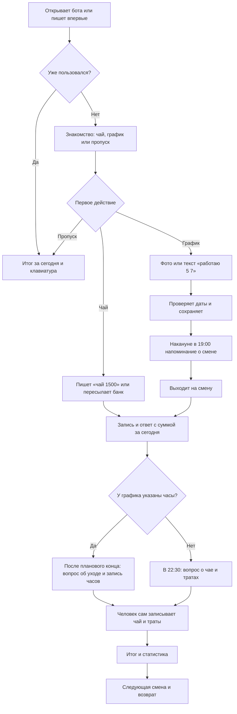

# Путь пользователя: от первой смены до следующего возвращения

Дата анализа: 4 октября 2026. Это карта **фактического поведения локального кода**, а не описание уже проверенного поведения людей. Исправления после ревью сохранены локально; перед оценкой работающего бота нужно сверить версию на сервере. Каталог `legacy/` и экспериментальные скрипты в сценарий не входят.

## Задача, ради которой человек открывает бот

После смены быстро записать чаевые и траты, увидеть сумму «чистыми», а перед следующей сменой вовремя получить напоминание. График, часы, продажи и отчёты помогают этой задаче, но каждый дополнительный шаг может помешать завершить основной цикл.

**Минимальный успешный цикл:** человек записал ближайшую смену → получил понятное напоминание → после смены внёс чай и траты → увидел итог → вернулся к следующей смене.

Стрелка `M → O` показывает **ожидаемое действие человека**, а не автоматический переход в коде: после записи часов бот не открывает шаг ввода чаевых. Это один из главных разрывов.

## Фактические сценарии

| Сценарий | Что делает человек | Что делает бот | Что считаем успехом |
|---|---|---|---|
| Первый вход | `/start` или сразу присылает текст | Показывает знакомство и выбор «чаевые / график / не сейчас». Если первый текст уже содержит операцию, после приветствия обрабатывает и её | Первая полезная запись без повторного ввода |
| Чай | Пишет `чай 1500` либо пересылает уведомление банка | Сохраняет сумму, показывает текущий итог и кнопку отмены; во время знакомства спрашивает про траты | Человек понимает сумму и счёт |
| График по тексту | Пишет `работаю 5 7` | Добавляет даты смен; ранее записанные даты остаются | Подтверждены нужные дни |
| График по фото | Отправляет фото, выбирает строку и месяц, смотрит прочитанные часы, нажимает «Сохранить» | Сохраняет распознанные дни и часы; пытается отправить их в Google Calendar | Все дни и часы верны, ошибку можно поправить |
| Накануне | Ждёт напоминания | В 19:00 по Москве отправляет сообщение по запланированной смене, если напоминания включены; вечером есть повторы при сбое | Сообщение пришло один раз и по верной дате |
| Смена с часами | Отвечает после планового конца, во сколько ушёл | Просит подтвердить фактическое время; ставку предлагает отдельно | Часы записаны и видны в `/work` |
| Смена без часов | Отвечает на сообщение в 22:30 | Просит записать чай или траты; кнопки под сообщением ведут сразу к тратам | Чай и траты записаны, итог показан |
| Возврат | Открывает чат или миниапп | `/start` показывает итог за сегодня; миниапп показывает обзор, календарь, сравнение и историю | Человек быстро находит последнюю смену и следующий шаг |
| Продажи | Пишет продажу/отчёт в чате, смотрит раздел «План» | В миниаппе разрешает правки, но новые продажи вводятся в чате | Пользователь понимает, где создать запись и где исправить |
| Администратор ресторана | Приглашает сотрудника и подтверждает заявку | Видит список сотрудников и их продажи после присоединения; личный чай не видит | Доступ понятен обеим сторонам |

## Подтверждённые разрывы в логике

Приоритет означает влияние на основной цикл или достоверность Research. Он не означает доказанную причину ухода: для этого нужны наблюдения за людьми.

| ID | Приоритет | Разрыв | Основание в коде | Что проверить с человеком / как исправить |
|---|---|---|---|---|
| J1 | Высокий | Выбор «добавить график» в знакомстве оставляет `tutorial_step='tip'`. Даже сохранённый график не завершает знакомство; Research может считать такого человека остановившимся | `ux_chat.py` `begin`, `choose_schedule`; `schedule_chat.py` `photo_action`; `handlers.py` `handle_text` | Считать успешное сохранение графика отдельным завершением выбранной ветки. Проверить, считает ли пользователь график своей первой полезной операцией |
| J2 | Высокий | При графике с часами сообщение в 22:30 о чае/тратах пропускается всегда. После окончания смены приходит только вопрос о времени ухода; после ответа нет явного перехода к чаю | `jobs.py` `evening_shift_prompt`; `schedule_chat.py` `prompt_work_end`, `save_actual` | После подтверждения часов предложить запись чая и трат в том же потоке; измерить долю закрытых часов без чая |
| J3 | Высокий | Повторный импорт графика добавляет и обновляет дни, но не удаляет старые. Ошибочная дата продолжит жить и может вызвать лишнее напоминание | `schedule_chat.py` текст предпросмотра; `migration_v12.sql` `save_schedule`; в UI календаря нет удаления | Показывать разницу «добавить / изменить / убрать» за месяц, подтверждать замену месяца и давать отмену |
| J4 | Высокий | «Закрыть смену» в клавиатуре означает внесение трат, а запись фактических часов — отдельный `/hours` или сообщение после смены. Оба пути регистрируют `shift_closed`; показатель «первая закрытая смена» смешивает разные действия | `handlers.py` `shift_close_button`, `shift_spend_chip`; `schedule_chat.py` `save_actual`; `migration_v10.sql` `first_shift_closed` | Переименовать шаги в интерфейсе по их действию и разделить события аналитики: `expenses_finished` и `hours_recorded` |
| J5 | Средний | После отправки фото неверно прочитанные часы можно только принять, поменять месяц или отменить. Исправления конкретной ячейки нет; повторное распознавание может дать ту же ошибку | `schedule_chat.py` `photo_month`, кнопки предпросмотра | Дать исправить один день/время перед сохранением; наблюдать, сколько людей отменяет на предпросмотре |
| J6 | Средний | В миниаппе есть «Записать расход», но нет прямого ввода чая; продажу тоже создают только в чате. Вкладка с результатом не ведёт к главному действию | `webapp/index.html` обзор; `webapp/sales.js` форма истории; `sales_api.py` запрет `save` | Добавить заметный переход «Записать чай в чате» или единый ввод; проверить, пытаются ли люди нажать на график/сумму для ввода |
| J7 | Средний | Напоминание отправляется без кнопки действия, а UX Research не фиксирует доставку/переход после него. Можно увидеть запланированную смену и последующие записи, но нельзя надёжно оценить путь «получил → открыл → записал» | `jobs.py` `tomorrow_shift_reminder`; список событий `research.py` | Добавить явное действие к напоминанию и отдельные технические показатели попытки/успеха отправки; не трактовать отсутствие записи как непрочитанное сообщение |
| J8 | Средний | Старый пользователь при `/start` получает только итог за сегодня. Знакомство с новыми функциями доступно через помощь/`/learn`, но не появляется автоматически | `handlers.py` `cmd_start`; `ux_chat.py` `begin` | Для существующих пользователей показать один короткий доступный шаг о графике/напоминании; проверить, находят ли они функцию сами |
| J9 | Высокий | Обычная запись чая или расхода не имеет ключа повтора и отдельного ответа при неопределённом результате сохранения. Если запись прошла, а ответ не дошёл, повтор тем же текстом создаст вторую запись | `handlers.py` `handle_text`, `_save_bank_tips`, `shift_spend_amount`; `db.py` `add_entry` | Добавить идентификатор операции от сообщения Telegram и проверяемое повторное сохранение; при сомнении вести человека в историю, не просить отправлять новую сумму вслепую |

## Если основной путь ломается

| Ситуация | Сейчас | Безопасный путь, который нужен человеку |
|---|---|---|
| Бот не понял текст | Показывает примеры `чай 500` и `/help` | Один конкретный пример, близкий к введённому тексту |
| Фото не прочиталось или часы неверны | Можно повторить распознавание, сменить месяц или отменить | Исправить один день вручную; иметь видимый вариант записи дат текстом |
| Сохранение чая прошло, ответ не пришёл | Пользователь не знает, есть ли запись, и может отправить сумму ещё раз | Показать состояние «проверь историю» и безопасно принять повтор той же операции |
| Миниапп не открылся или подпись устарела | Показывает ошибку и просит открыть бот заново | Сохранить понятный путь к главному действию через чат |
| Напоминание не доставлено | Есть попытка повтора вечером, но пользователь не видит причину | Показать состояние напоминаний по команде и сохранить возможность вручную закрыть смену |

## Что видно в UX Research, а чего пока не видно

| Шаг | Сейчас видно | Ограничение |
|---|---|---|
| Первый запуск и знакомство | `user_started`, `onboarding_started`, `onboarding_step`, `onboarding_skipped` | Ветка графика не помечает знакомство завершённым |
| Первая финансовая запись | `tip_added`/`expense_added`, `first_value_action` | Событие может потеряться при сбое отдельного канала аналитики, хотя запись сохранена |
| Планирование смены | `shift_planned`, события распознавания фото | Не видно, сколько дней было на предпросмотре, какой день исправили и почему отменили |
| Напоминание | По журналу смен видно условие отправки | Нет исследовательского события или перехода из сообщения; текущий код не получает факта прочтения |
| Закрытие смены | `shift_closed`, `first_shift_closed` | Смешаны траты и часы; событие «готово» можно получить даже без чая |
| Миниапп | `cabinet_opened`, `cabinet_loaded`, `tab_opened`, ошибки | Путь между просмотром результата и следующей записью не выражен отдельным действием |

Для маленькой аудитории важнее смотреть **путь каждого анонимного пользователя** и несколько разговоров с людьми, чем делать вывод из одного процента в воронке. Технические события следует сверять с фактом наличия записей и смен, не показывая личные суммы в админке.

## Проверка на реальных пользователях

Попросить 3–5 сотрудников выполнить задачи без подсказок и записать место остановки, время и вопрос человека:

1. Впервые открыть бота и записать вчерашние чаевые.
2. Добавить две ближайшие смены; затем исправить ошибочную дату или время.
3. После смены записать уход, чай и расход, найти итог «чистыми».
4. Получив напоминание, открыть нужное действие из сообщения.
5. Через несколько дней найти прошлую смену и понять, когда следующая.

Для каждой задачи фиксировать: **самостоятельно завершил / попросил подсказку / бросил**, количество сообщений до результата и слова пользователя о том, что он ожидал увидеть. Эти наблюдения покажут, какие разрывы действительно мешают, а какие остаются только рисками по коду.

## Рекомендуемый порядок изменений

1. Сделать повтор записи чая/трат безопасным, а при неизвестном исходе давать путь проверки в истории.
2. Объединить после смены запись часов, чая и трат в один понятный поток; разделить одноимённые события аналитики.
3. Исправить корректировку графика и ветку знакомства через график до расширения импорта фото.
4. Добавить действие в напоминание и измерять технический факт отправки и следующий шаг пользователя.
5. Упростить переход из миниаппа к записи чая и продаж.
6. Повторить короткие пользовательские проверки после изменения и сравнить реальные пути, а не только общий счётчик событий.
